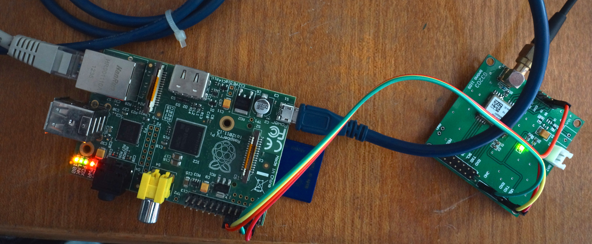

#建立自己的GPS时间服务器

# 1 准备树莓派

## 1.1 下载烧录

从树莓派官网 [http://raspberrypi.org](http://raspberrypi.org) 的下载页面下载Raspbian的最新版本。这次下载到的是2014年12月24日发布的版本。因为速度实在太慢，下了Torrent的种子，由bt软件去下载了。

这次下载得到的文件是：2014-12-24-wheezy-raspbian.img 。

准备了8G的SD卡，把SD卡插入Mac，先mount看一下：

	/dev/disk2s1 on /Volumes/Untitled (ntfs, local, nodev, nosuid, read-only, noowners)

说明会这个SD卡被识别为/dev/disk2。

在Finder里关闭这个盘，然后：

	sudo dd if=2014-12-24-wheezy-raspbian.img of=/dev/disk2 bs=1m

dd完成后，这个盘会被自动mount回来，卷标是boot。打开，找到其中的cmdline.txt文件，编辑。将其中的
	
	dwc_otg.lpm_enable=0 console=ttyAMA0,115200 kgdboc=ttyAMA0,115200 console=tty1 root=/dev/mmcblk0p2 rootfstype=ext4 elevator=deadline rootwait

改成
	
	dwc_otg.lpm_enable=0 console=tty1 root=/dev/mmcblk0p2 rootfstype=ext4 elevator=deadline rootwait

这样就不会在启动时将串口用做终端了。

## 1.2 启动

上电后，在路由器管理页面上找到这个树莓派，将它的IP地址静态分配为192.168.1.21。

ssh进入，默认用户pi，默认密码raspberry。先做基本配置：

	sudo raspi-config

这些菜单项需要做一下：

	1 Expand Filesystem
		进去把SD卡扩展一下
	2 Change User Password
		修改默认密码
	4 Internationalisation Options
	 	I2 Change Timezone
	 	修改为亚洲/上海
	8 Advanced Options
		A2 Hostname 
		修改为NTPSRV
		A7 Serial
		禁止串口上的shell

最后重启一下RPi。	

因为RPi是默认装了ntpd的，所以再起来以后，你会发现时间已经是正确的了。

## 1.3 刷新

先来刷新、更新：

	sudo apt-get update
	sudo apt-get upgrade
	sudo apt-get dist-upgrade
	sudo rpi-update

做完后，检查一下：

	uname -a

得到
	
	Linux NTPSRV 3.12.35+ #733 PREEMPT Tue Jan 6 21:03:44 GMT 2015 armv6l GNU/Linux

## 1.4 安装picocom

	sudo apt-get install picocom

然后就可以进picocom看一下：

	picocom /dev/ttyAMA0

这是默认的开始界面：

	picocom v1.7

	port is        : /dev/ttyAMA0
	flowcontrol    : none
	baudrate is    : 9600
	parity is      : none
	databits are   : 8
	escape is      : C-a
	local echo is  : no
	noinit is      : no
	noreset is     : no
	nolock is      : no
	send_cmd is    : sz -vv
	receive_cmd is : rz -vv
	imap is        : 
	omap is        : 
	emap is        : crcrlf,delbs,

	Terminal ready

Ctrl-A然后Ctrl-X退出picocom。

# 2 准备GPS模块

G3203是基于U-Blox NEO 5Q做的GPS板，板上除了UART输出的NMEA-0183数据外，也会输出PPS。

图2-1是测试PPS信号的电路连线：

右边的USB串口板同时给GPS供电。示波器探头接在PPS输出上。G3203的J1的2脚标着TP，意思是time pulse，就是5Q的PPS输出。

图2-2是PPS信号，从中可以看出每秒一个正脉冲：

图2-3是放大的PPS信号，从中可以看出脉冲宽度是100ms：

# 3 连接GPS

图3-1是RPi的GPIO插座的定义：

可以看出，接GPS的串口数据时需要用到

* P1-04 5V Power
* P1-06 Gound
* P1-10 RXD
* P1-12 GPIO 18

与G3203的J4连接如下：

RPi    | G3203 | 说明
-------+-------+-----
P1-04  | J4-1  | 5V
P1-06  | J4-6  | Ground
P1-10  | J4-2  | G3203's TXD -> RPi's RXD
P1-18  | J1-2  | PPS

连接完成后，在RPi上启动picocom，就能看到GPS的输出。

# 4 PPS

首先修改启动配置：

	sudo vi /boot/cmdline.txt
	
在行末加上（用大写的A就可以直接到行末去添加）

	bcm2708.pps_gpio_pin=18	

然后，

	sudo vi /etc/modules
	
在最后加上：

	pps-gpio
	
重启后，就可以看到/dev/pps0。lsmod也可以看到pps_gpio和pps_core两个模块了。

安装pps-tools：

	sudo apt-get install pps-tools

可以测试PPS了：

	sudo ppstest /dev/pps0

得到：

	trying PPS source "/dev/pps0"
	found PPS source "/dev/pps0"
	ok, found 1 source(s), now start fetching data...
	source 0 - assert 1421066632.974111422, sequence: 1698 - clear  0.000000000, sequence: 0
	source 0 - assert 1421066633.974045488, sequence: 1699 - clear  0.000000000, sequence: 0

# 5 gpsd

安装gpsd：

	sudo apt-get install gpsd gpsd-clients python-gps
	
启动gpsd：

	sudo gpsd /dev/ttyAMA0 -n -F /var/run/gpsd.sock

查看gps数据：

	cgps -s 
	
得到：

	┌───────────────────────────────────────────┐┌─────────────────────────────────┐
	│    Time:       2015-01-12T13:11:51.000Z   ││PRN:   Elev:  Azim:  SNR:  Used: │
	│    Latitude:    30.282909 N               ││   3    17    263    34      Y   │
	│    Longitude:  120.106591 E               ││   8    54    346    31      Y   │
	│    Altitude:   55.9 m                     ││   9    00    323    00      Y   │
	│    Speed:      0.0 kph                    ││  14    18    150    41      Y   │
	│    Heading:    0.0 deg (true)             ││  16    60    279    37      Y   │
	│    Climb:      0.0 m/min                  ││  19    06    196    16      Y   │
	│    Status:     3D FIX (13 secs)           ││  20    06    293    00      Y   │
	│    Longitude Err:   +/- 2 m               ││  21    07    098    00      Y   │
	│    Latitude Err:    +/- 2 m               ││                                 │
	│    Altitude Err:    +/- 6 m               ││                                 │
	│    Course Err:      n/a                   ││                                 │
	│    Speed Err:       +/- 17 kph            ││                                 │
	│    Time offset:     0.639                 ││                                 │
	│    Grid Square:     PM00bg                ││                                 │
	└───────────────────────────────────────────┘└─────────────────────────────────┘

配置gpsd会在系统启动时装载：

	sudo dpkg-reconfigure gpsd
	
注意当询问运行选项时，要加上-n来保证启动的时候会连接GPS。

# 6 编译一个支持PPS的ntpd

RPi自带的nptd是一个裁剪版，不支持PPS，所以得自己下载源码编译一个。

先安装libcap-dev：

	sudo apt-get install libcap-dev

然后从：
[http://archive.ntp.org/ntp4/]()
找到最新的ntpd版本，下载在rpi上：

	wget http://archive.ntp.org/ntp4/ntp-4.2.8p1.tar.gz

解压、配置、编译：

	tar xzf ntp-4.2.8p1.tar.gz
	cd ntp-4.2.8p1/
	./configure --enable-linuxcaps
	
配置要花不少时间，在我的RPi上用了13分钟。

然后make：
	
	make

编译也要不少时间，我用了20分钟。先安装到/usr/local：

	sudo make install	

停下现在的ntpd：

	sudo service ntp stop
	
拷贝文件：

	sudo cp /usr/local/bin/ntp* /usr/bin/
	sudo cp /usr/local/sbin/ntp* /usr/sbin/
	
启动ntpd:

	sudo service ntp start
	
# 6 连接ntpd和gpsd

编辑ntp.conf:

	sudo vi /etc/ntp.conf
	
在所有的server行之前加上：

	# Server from shared memory provided by gpsd
     server 127.127.28.0 minpoll 4 maxpoll 4
     fudge 127.127.28.0 time1 0.000 refid GPS stratum 15
     
	# Kernel-mode PPS ref-clock for the precise seconds
     server 127.127.22.0 minpoll 4 maxpoll 4
     fudge 127.127.22.0  flag3 1  refid PPS   

并把原本的4行server改成：

	server 0.debian.pool.ntp.org minpoll 10 maxpoll 15 iburst prefer
	server 1.debian.pool.ntp.org minpoll 10 maxpoll 15 iburst
	server 2.debian.pool.ntp.org minpoll 10 maxpoll 15 iburst
	server 3.debian.pool.ntp.org minpoll 10 maxpoll 15 iburst

然后重新启动ntpd：

	sudo service ntp restart
	
查看一下ntpd的连接情况：

	ntpq -crv -p

	associd=0 status=011b leap_none, sync_pps, 1 event, leap_event,
	version="ntpd 4.2.8p1@1.3265 Thu Feb 26 13:54:39 UTC 2015 (1)",
	processor="armv6l", system="Linux/3.12.35+", leap=00, stratum=1,
	precision=-18, rootdelay=0.000, rootdisp=1.165, refid=PPS,
	reftime=d899ab44.a7651f4e  Thu, Feb 26 2015 22:25:08.653,
	clock=d899ab50.198f4bd4  Thu, Feb 26 2015 22:25:20.099, peer=64998, tc=4,
	mintc=3, offset=0.187453, frequency=-42.887, sys_jitter=0.362315,
	clk_jitter=18.806, 	clk_wander=0.120
     remote           refid      st t when poll reach   delay   offset  jitter
	==============================================================================
	 SHM(0)          .GPSD.          15 l   13   16  377    0.000  -129.68   1.609
	oPPS(0)          .PPS.            0 l   12   16  377    0.000    0.187   0.362
	*dns.sjtu.edu.cn 79.213.241.147   3 u   34   32   41   15.281   -0.708  76.747
	+dns1.synet.edu. 202.118.1.46     2 u    7   32   27   53.652   -0.970  75.937	

需要等候一点时间才会看到PPS起作用。

这里的字段含义是：

* remote:ntp 的主机或主机名称，"+"表示当前正在作用的上层ntp,”*“表示有连上线，但作为次要的ntp主机。
* refid:参考的上层ntp主机地址。
* st:stratum阶层。类似于 DNS,由大至小。
* when:几秒前做过时间同步。
* poll:下一次更新在几秒之后。
* reach:已经上层NTP服务器要求更新的次数。
* delay:网络传输过程中延迟的时间，单位为百万分之一秒。
* offset:时间补偿的结果，单位为百万分之一秒。
* jitter:系统时间与BIOS硬件时间的差异时间。

注意到这里GPS的数据有130ms的误差，重新编辑ntp.conf，把这个误差做进去：

	fudge 127.127.28.0 time1 +0.130 refid GPSD stratum 15

# 7 对外提供ntpd服务

再次编辑/etc/ntp.conf，找到restrict段：

	# Local users may interrogate the ntp server more closely.
	restrict 127.0.0.1
	restrict ::1
	
在其后加上：
	
	restrict 192.168.1.0 mask 255.255.255.0 nomodify

这样就允许本地LAN内的机器获得时间数据了。

如果在上面那条配置中，把最后的nomodify去掉，则可以从本地机器上直接查看ntpd的情况，如：

	ntpq -p 192.168.1.21
	
如果你的ntp服务器的ip是21的话。

在Windows上，可以调整Internet时间服务器的地址为自己的：

# 参考文献

1. gpsd — a GPS service daemon，[http://catb.org/gpsd/]()

2. The Raspberry Pi as a Stratum-1 NTP Server， [http://www.satsignal.eu/ntp/Raspberry-Pi-NTP.html]()

3. GPSD Time Service HOWTO，[http://catb.org/gpsd/gpsd-time-service-howto.html]()
