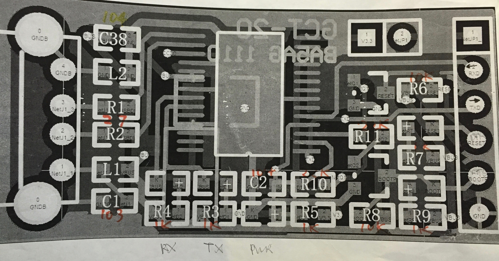
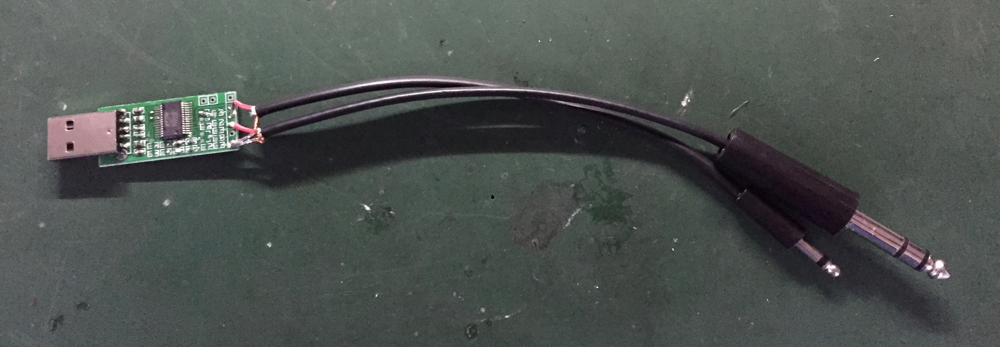
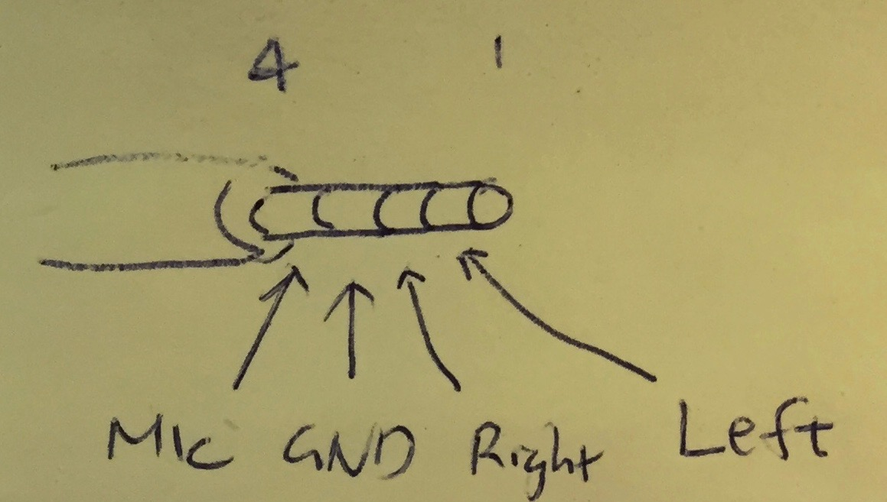
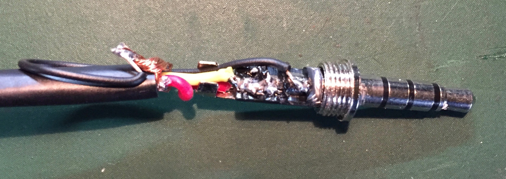
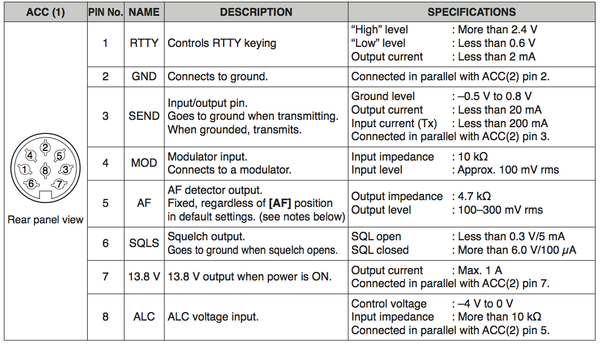
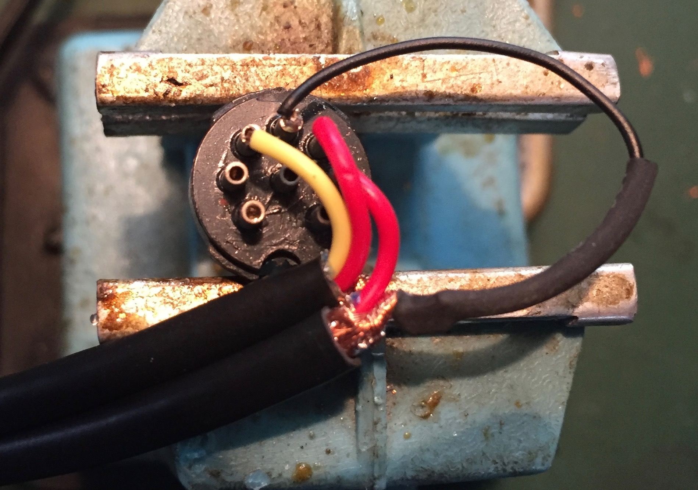
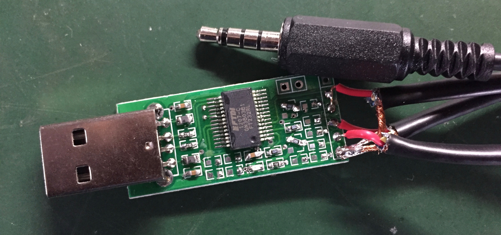
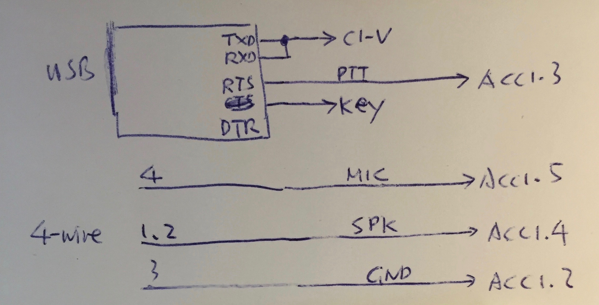
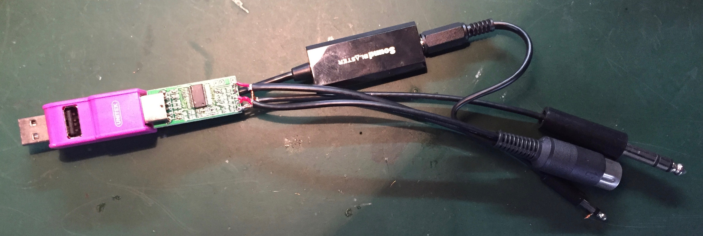
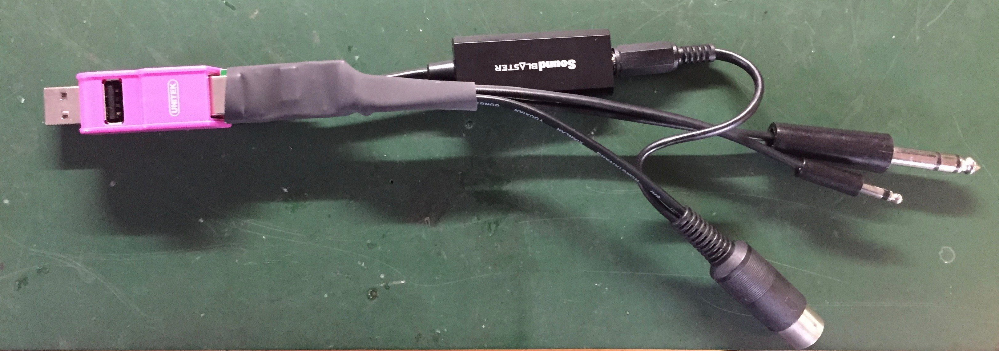

# 做一条USB电台控制线

我需要一条电台控制线，连接PC和电台，能获得电台的频率和模式，能产生CW信号，能控制PTT，能将电台接收到的声音接入电脑，能把电脑的声音传给电台去发射。

几年前做这样的线的时候，都是用的串口-TTL芯片，由串口信号来控制CW电键和PTT，声音则是音频线接到PC的声卡。不过现在电脑基本上都没有串口了，所以还得一个USB串口设备来产生串口。

所以，我就打算用一个USB串口芯片，加上USB声卡来做这样一条控制线。这样，从PC只要接一根USB线，另一头就可以直接接电台了。也就是下图的样子：

我不想做通用的，平时在用的电台没那么多型号，为主设备做一条线就可以了。下次需要接其他设备，再做一条就是了。整条线的成本就很低，犯不着为了“通用”而动脑筋增加中间接口什么的。

所以这次我做的是为ICOM 756用的。

##材料准备
做这条线需要以下材料：

1. USB-UART(TTL)板。市售的板子很多，但是不少只支持RXD和TXD。所以要小心选择还能支持RTS、CTS、DTR或DTS中的两条信号的。我用的是自己做的板子，支持RTS和DTR，当信号无效（inactive）的时候是高电平的。如果你买到的板子在无效的时候是低电平的也不要紧，大多数软件里都可以设置这个电平。
2. USB HUB。我找了一个三口的小HUB，其实有两口就够了。
3. USB声卡。我买了个SoundBlaster的Play!2。心想着是牌子好一点，不过它的连接线是4芯的，耳机/话筒在一个插座上，连线复杂了点。
4. 圆8脚插头，用于756的ACC-1插座。
5. 3.5mm两芯插头，用于756的CAT插座。
6. 6.5mm三芯插头，用于756的电键插座。
7. 3.5mm四芯插头，用于声卡的耳机/话筒插座。
8. 15mm长的两芯屏蔽线4段。
9. 热缩套管一些。

##连线

###USB-UART板

我的USB-UART板原本用于其他目的，板上的RTS和DTR信号上是要接三极管做反相的，所以要先调整一下，用几个0欧姆电阻短接一下，让芯片的RTS和DTR信号直接通到外接的焊盘上去。

###电键和CAT

电键线是最简单的了。将DTR和地分别接到三芯6.5mm插头的中心和地上就好了。
CAT则是首先把板上的RTX和TXD两个输出段子短接，然后接到3.5mm两芯插头的中心。

###音频线

音频线有点复杂，首先来看声卡一侧，声卡的插座是4芯的：

我们把左右声道直接连上，接两芯屏蔽线的黄线，插头的地接红线，最内侧的环接地。

在电台一侧是圆8脚的ACC-1，插座的连线是：

这里需要放两条两芯屏蔽线，一条连接两路音频信号，另一条连接PTT信号。

因此，对应的连线是：

ACC1脚 | 线 | 颜色 | 对端
------+----+------+-----
   2  |  音频/PTT | 黑  |  USB板的地和声卡插头的地
   3  |  PTT     |红  |  USB板的RTS
   4  |  音频     |黄  |  声卡的耳机
   5  |  音频     |红  |  声卡的话筒
   

总结一下，连线是这样的：

##完工

最后把USB声卡和USB-UART板插到USB HUB上就好了：

用热缩套管把整个USB-UART板封起来：

这样一条PC-电台线就完工了。